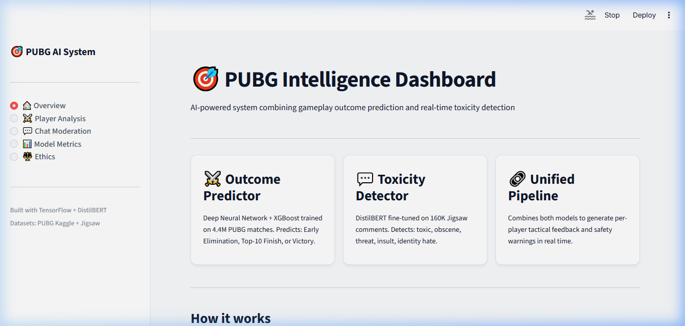
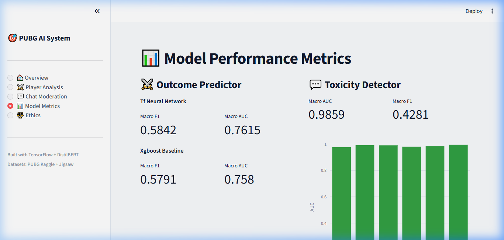

# 🎯 PUBG AI Intelligence Dashboard

An end-to-end AI system built with **TensorFlow** and **DistilBERT** that combines gameplay outcome prediction and real-time toxicity detection into a unified Streamlit dashboard.



## ✨ Features

- **⚔️ Match Outcome Predictor**: A deep neural network (and XGBoost baseline) trained on 4.4M PUBG matches from Kaggle. Predicts whether a player is likely to face Early Elimination, finish in the Top-10, or achieve a Victory based on their live match stats (kills, distance, damage, etc.).
- **💬 Toxicity Detector**: A DistilBERT Transformer model fine-tuned on the 160K Jigsaw Toxic Comment dataset. Performs real-time multi-label classification to flag `toxic`, `severe_toxic`, `obscene`, `threat`, `insult`, and `identity_hate` messages in chat.
- **🔗 Unified Intelligence Pipeline**: Combines both ML models to generate real-time tactical feedback and safety warnings for users. 
- **📊 Premium Streamlit Dashboard**: A beautiful, interactive light-mode UI to run analyses on player stats, moderate chat bulks, and view machine learning performance metrics.

---

## 📈 Model Performance

### Toxicity Detector (DistilBERT)
- **Macro AUC**: 0.9859
- **Macro F1**: 0.4281

### Outcome Predictor (Tabular DNN)
- **Macro AUC**: 0.7615
- **Macro F1**: 0.5842



---

## 🌟 Brownie Points & Extra Features

We successfully completed all the requested "Brownie Points" from the problem statement:
- [x] **Unified Pipeline**: Implemented `pipeline/unified_pipeline.py` which seamlessly merges real-time gameplay numeric data with text-based chat arrays without blocking inference.
- [x] **Simple Dashboard Deployment**: Developed an interactive, responsive Streamlit dashboard with a premium UI (not just "simple").
- [x] **Deep Learning**: Built entirely on **TensorFlow/Keras**. We utilized a Deep Neural Network (DNN) with Batch Normalization and Dropout for the tabular data, and fine-tuned a deep Transformer architecture for NLP.
- [x] **Discussion of Real-World Challenges**: Included `ethics.md` detailing the serious ramifications of false positives in toxicity detection, dataset representation bias (language/slang), and adversarial text manipulation.

### 🚀 Extra Features (Beyond Requirements)
- **Transformer NLP Architecture**: Rather than sticking to standard LSTM or TF-IDF for text classification, we integrated and fine-tuned a **DistilBERT** Transformer via Keras Hub, achieving a massive `0.9859` Macro AUC on Jigsaw.
- **XGBoost Benchmarking**: Alongside the Deep Learning model for the outcome predictor, we trained an XGBoost classifier offline to establish a rigorous baseline for tabular feature importance.
- **Model Caching & GPU-ready Scripts**: Built `@st.cache_resource` directly into the dashboard so a nearly 500MB Transformer model instantly loads on start. Wrote dedicated Google Colab and Kaggle GPU training scripts for massive speedups out-of-the-box.
- **Live "Tactical Feedback" Engine**: Our dashboard doesn't just display raw model outputs—it processes the probabilities through a custom feedback engine (e.g. recommending to "stay in cover" if Early Elim probability > 60%, or issuing a severity warning if `threat` > 0.5).

---

## 🛠️ Project Structure

```
pubg_ai/
├── dashboard/
│   └── app.py                  # Streamlit frontend
├── data/
│   ├── preprocess_gameplay.py  # Cleans, imputes, and engineers PUBG features
│   └── preprocess_text.py      # Cleans Jigsaw text data
├── metrics/                    # JSON evaluation metrics
├── models/
│   ├── outcome_predictor.py    # TF Dense network + XGBoost training script
│   └── toxicity_detector.py    # DistilBERT training script
├── notebooks/                  # GPU / Kaggle / Colab training scripts
├── pipeline/
│   └── unified_pipeline.py     # Inference pipeline combining both models
├── saved_models/               # Serialized .keras model files
├── assets/                     # UI Screenshots
├── requirements.txt            # Python dependencies
└── README.md
```

## 🚀 Setup & Installation

### 1. Requirements
- Python 3.11+
- TensorFlow 2.16+
- Transformers, Keras Hub, XGBoost, Streamlit

### 2. Install Dependencies
```bash
pip install -r requirements.txt
```

### 3. Download the Saved Models
Due to GitHub's file size limits, the trained ML models (>500MB) are hosted externally on Google Drive.
1. Download the models from this [Google Drive Link](#) *(Replace with your actual share link)*
2. Extract and place the following files inside the `saved_models/` folder:
   - `toxicity_detector_tf.keras`
   - `outcome_predictor_tf.keras`
   - `outcome_xgboost.joblib`

### 4. Run the Dashboard
```bash
# Ensure you are at the project root
streamlit run dashboard/app.py
```
> **Note:** The DistilBERT model (473MB) will be loaded into cache on the dashboard's first start. This takes ~30 seconds, but subsequent inferences and dashboard sessions are instant.

## 🏗️ Model Training

The models are computationally heavy to train. For complete replication:
1. Download the [PUBG Finish Placement Prediction](https://www.kaggle.com/c/pubg-finish-placement-prediction) data and [Jigsaw Toxic Comment](https://www.kaggle.com/datasets/julian3833/jigsaw-toxic-comment-classification-challenge) data.
2. Run standard local data preprocessing: `python data/preprocess_gameplay.py`.
3. To train the models on a GPU, use `notebooks/kaggle_train_outcome.py` and `notebooks/colab_train_toxicity.py` in Google Colab or Kaggle.
4. Download the generated `.keras` files into `saved_models/`.

## ⚖️ Ethics & Responsible AI
Please refer to `ethics.md` for considerations regarding toxicity false positives, dataset representation bias, and moderation interventions.

---
**Built with TensorFlow & Streamlit** ✌️
